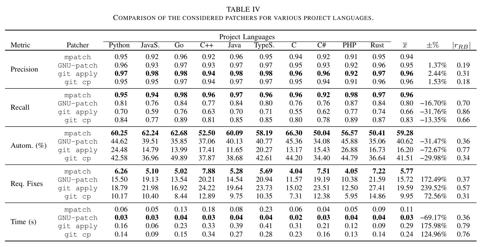

# Reproduction Package for Pushing the Boundaries of Patch Automation

This artifact comprises the files and data to reproduce our evaluation of various patchers, including mpatch.

__Note__: Through the anonymization, markdown-references to directories and files may be broken. 
Therefore, this README mentions the links literally without automated referencing. 

## Contents

- The `evaluation-workdir/data` directory contains our mined sample of 5000 GitHub repositories and our dataset of mined patch scenarios.
The repository sample and datasets are compressed as zip archives that have to be unpacked before they can be used.

__Note__:

- The `repo-sample.zip` file in `evaluation-workdir/data/` contains a single-yml file which enumerates the metadata for all sampled repositories.
- To unpack the dataset of cherry picks, you may need to perform the following command on a Linux console first. Thereafter, you can extract all the mined cherry picks from the created `unsplit-mined-cherries.zip` file.


```shell
zip -s 0 mined-cherries.zip --out unsplit-mined-cherries.zip
```


- The `mpatch` directory contains the mpatch tool which is implemented in Rust. In its `README` file, you can find instructions on
how to generate the documentation for mpatch.

- The `src` directory contains 
  - the implementation of our evaluation setup in the Java (`java`) and Kotlin (`kotlin`) directories.
  The main file of the evaluation is `PatcherEvaluationMain.kt` (located in `src/main/kotlin/org/anon/evaluation`).
  - The scripts for computing the various metrics for the different patchers and for performing the statistical analysis located in `python/result_analysis`.

## Results without outliers
In Section VI.A (2) of the submitted paper, we mention that we re-analyzed our results after excluding outliers.
Specifically, we removed the top 0.05% of results with the highest number of required fixes for each patcher; thus, treating patchers equally with this regard.
The adapted results are shown in the table below.

