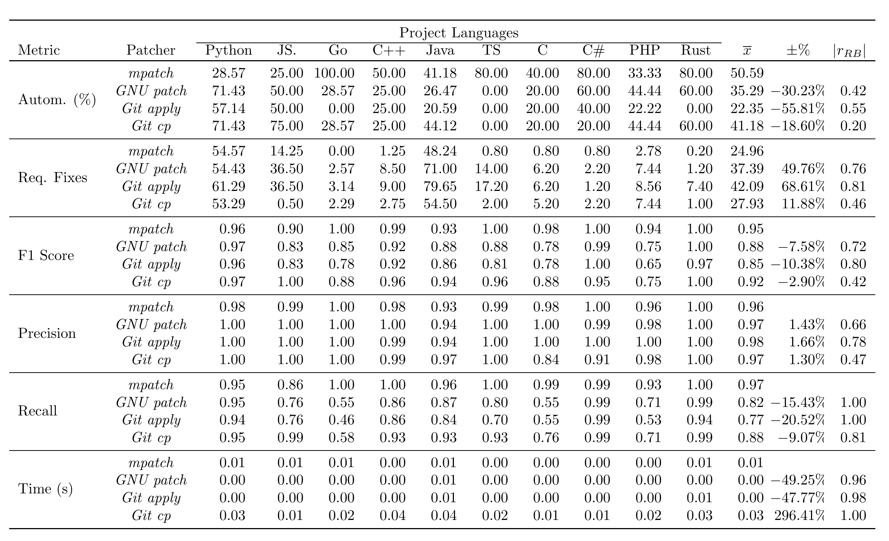

# Decades of GNU Patch and Git Cherry-Pick: Can We Do Better?

This is the reproduction package for our paper _Decades of GNU Patch and Git Cherry-Pick: Can We Do Better?_ which has been accepted to the 48th International Conference on Software Engineering (ICSE 2026).

## Content

The reproduction package consists of three main parts:

1. [**mpatch**](/mpatch/README.md): The implementation of our novel match-based patcher, written in Rust.
2. [**Mined cherries**](dataset/): Our dataset of cherry picks mined from 5,000 GitHub repositories.
3. [**Empirical evaluation**](src/main/kotlin/org/variantsync/evaluation/PatcherEvaluationMain.kt): Our empirical evaluation of different language-agnostic patchers.

## Requirements

Software Requirements

- [Docker](https://www.docker.com/)

Hardware Requirements

- We recommend running the evaluation on a system with at least **64GB** of primary memory (RAM).
- 100GB—2TB of free drive space, depending on the configuration of the Docker image.

> [!WARNING]  
> The used storage medium should be very fast, e.g., M.2 NVMe SSD with 5000 MB/s, otherwise the evaluation may take an extremely long time.

Other Requirements

- A stable internet connection.

## Installation

### [Optional] Configuration

Before building the Docker image, you may **optionally** configure how the evaluation is executed.
To this end, we provide two configuration files: [config-reproduction.properties](docker/config-reproduction.properties) for the configuration of the reproduction of the entire evaluation, and [config-verification.properties](docker/config-verification) for the verification of the correct installation of the reproduction package.

Depending on the available hardware, you may need to adjust the following settings:

- The number of threads used (i.e., how many repositories are processed in parallel). Please note that each thread requires an additional `40GB` of free space on your drive.
- Whether all repositories should be cloned before the evaluation. This eliminates the need for a stable internet connection once all repositories have been cloned.
- Whether repositories should be deleted after they have been evaluated. This significantly reduces the amount of required free space on your drive (around 100GB should be enough).

> [!WARNING]
> The entire set of repositories considered by our evaluation requires about 600 GBs of free space on our drive, if `clean-repositories` is set to `false`.

> [!NOTE]  
> Every change in the configuration must be followed by rebuilding the Docker image.

### Building the Docker image

The reproduction package is meant to be run in the Docker image that can be built using the provided Dockerfile.

#### Linux

On Linux, you can execute the provided `build.sh` script to build the Docker image.

> **Note:** The build process may take a while. (~5 minutes)

> **Note:** The build process may require sudo privileges.

```shell
./build.sh
```

#### Other OS

On other machines, you may call Docker directly.
In this case, you have to provide a USER_ID and GROUP_ID for the user in the Docker container:

```bash
# For example, under Linux, both variables are set as follows:
# USER_ID=$(id -u ${SUDO_USER:-$(whoami)})
# GROUP_ID=$(id -g ${SUDO_USER:-$(whoami)})

docker build --network=host --build-arg USER_ID=$USER_ID --build-arg GROUP_ID=$GROUP_ID -t mpatch-reproduction .
```

Ideally, the `USER_ID` and `GROUP_ID` match the ids of the user running the command (not root!).
Under Windows, you may provide any suitable id (e.g., `1000` for both)

```shell
docker build --network=host --build-arg USER_ID=1000 --build-arg GROUP_ID=1000 -t mpatch-reproduction .
```

### Verifying the correct installation

Once the building of the Docker image has completed, you can verify its correct installation.
By default, the verification will be executed within the [evaluation-workdir](evaluation-workdir) directory.

#### Starting the verification

On Linux, you can execute the provided `execute.sh` script with the `verification` argument:

```shell
./execute.sh verification
```

On other machines, you may start a Docker container from the Docker image with the following command:

```bash
# Depending on your OS, you may have to change how the first path to evaluation-workdir is defined
docker run --rm -v "./evaluation-workdir/":"/home/user/evaluation-workdir" mpatch-reproduction verification
```

> [!NOTE]  
> Depending on your hardware, the verification should require 5-30 minutes.

#### Verification in a custom directory

> [!NOTE]  
> You may provide any directory as first argument for `-v`, either by altering the `execute.sh` script or changing the command above.
> The `evaluation-workdir` is where the evaluation stores all its data while processing the repositories and evaluating patchers.
> The results will also be saved to this directory, once the evaluation or verification finishes.

For example, your may start the evaluation with

```shell
 docker run --rm -v "/home/YOUR_USERNAME/ICSE-reproduction/":"/home/user/evaluation-workdir" mpatch-reproduction verification
```

#### Expected outcome

> [!NOTE]  
> If you executed the evaluation in a custom directory, all mentioned files will be located there.

The verification should begin with output that looks similar to the following screenshot:

```shell
2025-08-21 14:36:30 [main] org.variantsync.evaluation.PatcherEvaluationMainKt.main()
INFO: Starting experiment initialization.
2025-08-21 14:36:30 [main] org.variantsync.evaluation.execution.EvalUtilsKt.createOrLoadSamples()
INFO: Loading dataset for C with 1 usable repositories
2025-08-21 14:36:30 [main] org.variantsync.evaluation.execution.EvalUtilsKt.createOrLoadSamples()
...
INFO: Loading dataset for TypeScript with 1 usable repositories
2025-08-21 14:36:30 [main] org.variantsync.evaluation.execution.EvalUtilsKt.createOrLoadSamples()
INFO: Done.

2025-08-21 14:36:30 [main] org.variantsync.evaluation.PatcherEvaluationMainKt.main()
INFO: Processing 5 repos in parallel
2025-08-21 14:36:30 [main] org.variantsync.evaluation.PatcherEvaluationMainKt.main()
INFO: Already considered 0 repos.
2025-08-21 14:36:30 [main] org.variantsync.evaluation.PatcherEvaluationMainKt.main()
INFO: Already processed a total of 0 evaluation runs.

2025-08-21 14:36:35 [main] org.variantsync.evaluation.PatcherEvaluationMainKt.main()
INFO: Considering a total of 85 cherry-picks for repetition 1
2025-08-21 14:36:35 [pool-1-thread-3] org.variantsync.evaluation.execution.EvalUtilsKt.cloneGitHubRepo()
INFO: cloning https://github.com/tensorflow/serving.git into /home/user/evaluation-workdir/REPOS/tensorflow_serving
...
```

The output shows that the dataset used for verification contains one repository for each project language. The projects are cloned into the `evaluation-workdir`.
Once a project has been cloned, the patchers are evaluated on the cherry picks (i.e., patches) that have been found for that repository.

The verification should complete with the following output:

```shell
Latexmk: All targets (metrics-verification.pdf) are up-to-date

++++++++++++++++++++++++++++++++++++
          Analysis done
++++++++++++++++++++++++++++++++++++

The result table can be found under evaluation-workdir/metrics-verification.pdf
```

After all repositories have been considered, the result analysis is executed.
The raw results can be found in the `evaluation-workdir/results` directory.

In addition, the script generates a PDF file with a result table similar to the one presented in our paper.
This table can be found under `evaluation-workdir/metrics-verification.pdf`.
It should look similar to this:


> [!NOTE]  
> The verification results shown are based on only a tiny portion of our dataset and are therefore not representative.

# Starting the reproduction

Once you have verified the correct installation, you can start the reproduction similar to how you started the verification.
You may also change the working directory to a custom directory as described for the verification.

On Linux, you can execute the provided `execute.sh` script with the `reproduction` argument:

```shell
./execute.sh reproduction
```

On other machines, you may start a Docker container from the Docker image with the following command:

```bash
# Depending on your OS, you may have to change how the first path to evaluation-workdir is defined
docker run --rm -v "./evaluation-workdir/":"/home/user/evaluation-workdir" mpatch-reproduction reproduction
```

> [!NOTE]  
> The results of the reproduction will be stored in the same manner as the results of the verification.

> [!NOTE]  
> Our evaluation processes large amounts of data.
> The main bottleneck is not the available CPU but the speed of the drive in which the `evaluation-workdir` is located.
> Depending on your hardware, the full reproduction may require a very long time. The expected runtime are 5-10 days, but the reproduction may also require several weeks if the drive is too slow.

## Troubleshooting

### 'Got permission denied while trying to connect to the Docker daemon socket'

`Problem:` This is a common problem under Linux, if the user trying to execute Docker commands does not have the permissions to do so.

`Fix:` You can fix this problem by either following the [post-installation instructions](https://docs.docker.com/engine/install/linux-postinstall/), or by executing the scripts in the replication package with elevated permissions (i.e., `sudo`).

### 'Unable to find image 'mpatch-reproduction:latest' locally'

`Problem:` The Docker container could not be found. This either means that the name of the container that was built does not fit the name of the container that is being executed (this only happens if you changed the provided scripts), or that the Docker container was not built yet.

`Fix:` Follow the instructions described above in the section `Build the Docker Container`.

### Failed to load class "org.slf4j.impl.StaticLoggerBinder"

`Problem:` An operation within the initialization phase of the logger library we use (tinylog) failed.

`Fix:` Please ignore this warning. Tinylog will fall back onto a default implementation (`Defaulting to no-operation (NOP) logger implementation`) and logging will work as expected.
